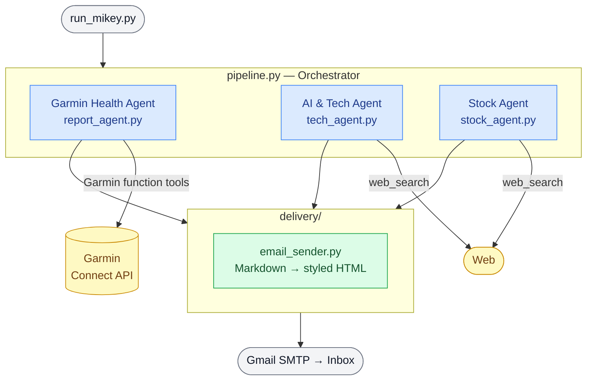

# Mikey Agent

> A personal multi-agent daily briefing — health insights, tech news, and stock analysis, all in one email.

Built with the [OpenAI Agents SDK](https://github.com/openai/openai-agents-python). Every morning (or on demand) it runs three specialized agents in sequence, stitches their output into a single styled email, and delivers it to your inbox.

---

## What it does

| Agent | What it produces |
|---|---|
| **Garmin Health Coach** | Running, sleep, and wellness insights from your Garmin Connect data — trends, scores, and motivational commentary |
| **AI & Tech Analyst** | The week's biggest moves in AI/LLM, data engineering, startups & M&A, and GPU infrastructure — web-researched with source links |
| **Stock Watch-list** | Per-ticker news, latest earnings, key metrics, and similar companies for your watch-list — ends with a top-N picks summary |

Each section gets its own color-themed banner inside a single "Mikey Briefing" email.

---

## Pipeline



## File structure

```
config.py              # single config file: model, topics, stock list, time windows
.env                   # secrets only (gitignored) — see .env.example

garmin/                # Garmin Connect data layer
  config.py            #   credentials loaded from .env
  client.py            #   OAuth token caching + MFA prompt on first run
  fetcher.py           #   14 daily endpoints + activities + profile → JSON

fetch_garmin.py        # standalone CLI: archive raw Garmin data to data/

agent/                 # OpenAI agents
  tools.py             #   Garmin function-tools exposed to the health agent
  report_agent.py      #   health coach agent (running / sleep / wellness)
  tech_agent.py        #   AI & tech research agent (web search)
  stock_agent.py       #   stock research agent (parallel per-ticker web search)
  pipeline.py          #   orchestrator: run all 3 → combine → email

delivery/              # email delivery
  config.py            #   SMTP config loaded from .env
  email_sender.py      #   Markdown → styled HTML + SMTP send via Gmail

run_mikey.py           # main CLI entry point
```

---

## Setup

### 1. Install dependencies

```bash
python -m pip install -r requirements.txt
```

### 2. Configure secrets

```bash
cp .env.example .env
```

Open `.env` and fill in:

```
GARMIN_EMAIL=you@example.com
GARMIN_PASSWORD=your_garmin_password

OPENAI_API_KEY=sk-...
OPENAI_MODEL=gpt-4o          # optional — overrides config.py MODEL

EMAIL_SENDER=you@gmail.com
EMAIL_APP_PASSWORD=xxxx xxxx xxxx xxxx
EMAIL_RECIPIENT=you@gmail.com
```

### 3. Gmail App Password (one-time)

Gmail requires an App Password for SMTP — your normal password won't work:

1. Enable **2-Step Verification** → [Google Account → Security](https://myaccount.google.com/security).
2. Generate a 16-character App Password at [myaccount.google.com/apppasswords](https://myaccount.google.com/apppasswords).
3. Paste it into `.env` as `EMAIL_APP_PASSWORD` (spaces are fine — they're stripped at runtime).

### 4. Garmin (first run only)

On the first run, Garmin exchanges your email/password for OAuth tokens, which are cached in `.garmin_tokens/` (gitignored). If your account has MFA enabled, you'll be prompted for the code — just run the script interactively once and every subsequent run will be silent.

---

## Usage

```bash
# Full pipeline: run all agents + send one combined email
python run_mikey.py

# Generate reports without sending email (saved to reports/)
python run_mikey.py --no-email

# Override the email recipient
python run_mikey.py --to someone@example.com

# Adjust health look-back windows
python run_mikey.py --running-days 60 --sleep-days 21
```

If one agent fails, the others still run and are included in the email with a warning.

### Archive raw Garmin data (optional)

`fetch_garmin.py` is a standalone utility that dumps raw Garmin JSON to `data/`. It's not needed for the briefing (the health agent fetches its own data), but useful for debugging or building a local archive:

```bash
python fetch_garmin.py --days 30
python fetch_garmin.py --start 2026-01-01 --end 2026-01-31
python fetch_garmin.py --categories sleep,steps,heart_rate
```

---

## Configuration

All non-secret, tunable values live in **`config.py`**:

| Setting | Description |
|---|---|
| `MODEL` | OpenAI model used by all agents (e.g. `gpt-4o`) |
| `GARMIN_RUNNING_DAYS` | How many days of running history to analyze |
| `GARMIN_SLEEP_DAYS` | How many days of sleep history to analyze |
| `GARMIN_GENERAL_DAYS` | Window for general wellness metrics |
| `TECH_TOPICS` | List of topics (with example sources) the tech analyst researches |
| `STOCKS` | Your stock watch-list (ticker symbols) |
| `TOP_STOCKS_TO_RECOMMEND` | How many stocks to highlight in the summary |

---

## Extending with a new agent

The pipeline is built to grow. To add a new report section:

1. Write a function that returns Markdown — see `agent/report_agent.py` as a reference.
2. Add a `ReportSection(title=..., markdown=..., theme=...)` to the list in `agent/pipeline.py`.
3. Add a matching `theme` key in `delivery/email_sender.py` if you want a distinct banner color.

---

## Dependencies

| Package | Purpose |
|---|---|
| `openai-agents` | Agent SDK — tool use, web search, orchestration |
| `garminconnect` | Garmin Connect API wrapper |
| `python-dotenv` | Load credentials from `.env` |
| `markdown` | Convert agent Markdown output to HTML for email |

---

## Security

- All secrets are loaded from `.env` at runtime — nothing is hardcoded.
- `.env`, `.garmin_tokens/`, `data/`, and `reports/` are all gitignored — no credentials or personal health data are ever committed.
- See `.env.example` for the full list of required variables.
